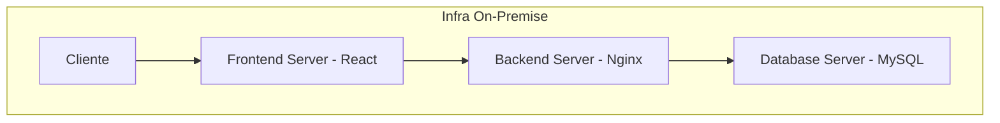
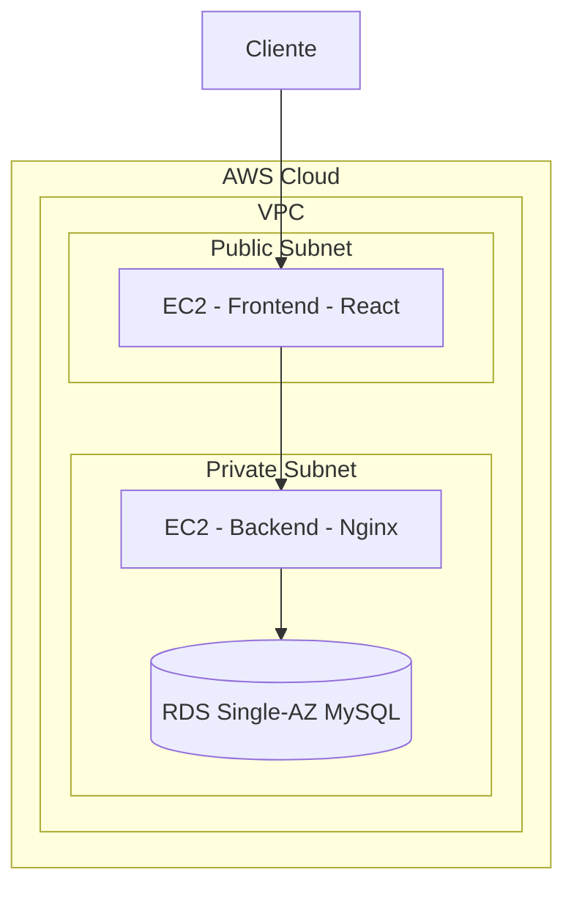
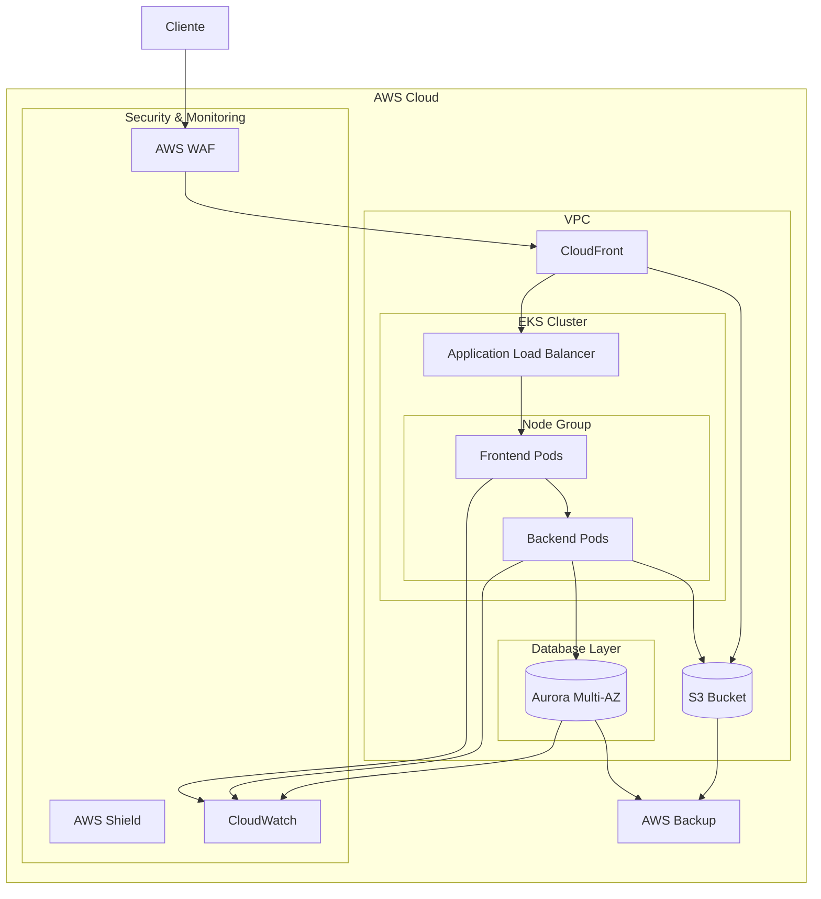

# 🚀 TI SOLUÇÕES INCRÍVEIS 
**Projeto:** _`Modernização de infraestrutura de servidores de aplicação Ecommerce`_  
**Cliente:** _`Fast Engineering S/A`_  
**Criado em:** _`10 de janeiro de 2025`_ - **Última atualização:** _`15 de janeiro de 2025`_

## 📋 Sumário
- [Visão Geral](#-vis%C3%A3o-geral)
- [Situação Atual](#situação-atual)
- [Arquiteturas](#arquiteturas)
  - [Arquitetura Atual](#arquitetura-atual)
  - [Migração Lift-and-Shift](#migração-lift-and-shift)
  - [Modernização com Kubernetes](#modernização-com-kubernetes)
- [Etapas do Projeto](#etapas-do-projeto)
  - [Etapa 1: Lift-and-Shift](#etapa-1-migração-lift-and-shift)
  - [Etapa 2: Modernização](#etapa-2-modernização-com-kubernetes)

## 🎯 Visão Geral

A Fast Engineering S/A busca modernizar seu sistema de eCommerce através de uma migração para AWS em duas etapas: uma migração inicial "lift-and-shift" seguida de uma modernização completa utilizando Kubernetes.

## 🏢 Situação Atual

Sistema on-premise composto por:
- Servidor de Banco de Dados MySQL (500GB, 10GB RAM, 3 Core CPU)
- Servidor Frontend React (5GB, 2GB RAM, 1 Core CPU)
- Servidor Backend com 3 APIs + Nginx (5GB, 4GB RAM, 2 Core CPU)

## 📐 Arquiteturas

### Arquitetura Atual

### Migração Lift-and-Shift

### Modernização com Kubernetes

## 📍 Etapas do Projeto

### Etapa 1: Migração Lift-and-Shift

- **Objetivo**: Migração rápida com mínimas alterações
- **Componentes Principais**:
  - Utilização de serviços AWS equivalentes
  - Segurança básica com grupos de segurança e ACLs

### Etapa 2: Modernização com Kubernetes

- **Objetivo**: Modernização completa da infraestrutura
- **Componentes Principais**:
  - Migração para Amazon EKS
  - Implementação de CI/CD
  - Banco de dados gerenciado com Aurora Multi-AZ
  - Sistema robusto de backup
  - Segurança avançada com WAF e Shield
  - Monitoramento com CloudWatch

## 📝 Observações

Os diagramas mostram a evolução da arquitetura em cada fase, com foco em:
1. Situação atual on-premise
2. Migração lift-and-shift mantendo a estrutura similar
3. Modernização completa com Kubernetes e serviços gerenciados

## 🔒 Segurança

- Implementação de WAF para proteção contra ataques web
- AWS Shield para proteção DDoS
- Grupos de segurança e Network ACLs
- Multi-AZ para alta disponibilidade
- Backup automatizado de dados críticos

## 📊 Monitoramento

- CloudWatch para métricas e logs
- Alertas automáticos
- Dashboard de monitoramento
- Rastreamento de performance

## 📫 Contato

Para mais informações sobre este projeto, entre em contato com a equipe de arquitetura.

---
⚡️ Desenvolvido por TI SOLUÇÕES INCRÍVEIS para Fast Engineering S/A
