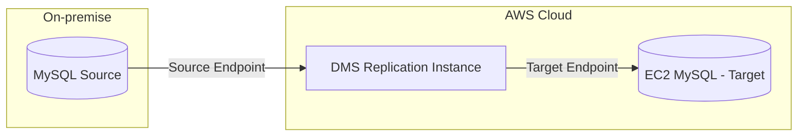

# Roteiro de Migração Lift-and-Shift  
## 1. Fase de Preparação  
### 1.1 AWS Application Migration Service (MGN)  
#### 1.1.1 Configure o ambiente AWS:
- Criar VPC com subnets públicas e privadas
- Configurar Security Groups
- Criar funções IAM necessárias
#### 1.1.2 Prepare os servidores de origem (on-premisse):
> Instalar AWS Replication Agent nos servidores Frontend e Backend.  
```bash
wget -O ./aws-replication-installer-init.py https://aws-application-migration-service-region.s3.region.amazonaws.com/latest/linux/aws-replication-installer-init.py  
sudo python3 aws-replication-installer-init.py
```
#### 1.1.3 AWS Database Migration Service (DMS):
- Preparar o banco MySQL de origem:
> Criar usuário para replicação
```sql
CREATE USER 'dms_user'@'%' IDENTIFIED BY 'password';
GRANT REPLICATION CLIENT, REPLICATION SLAVE ON *.* TO 'dms_user'@'%';
GRANT SELECT ON *.* TO 'dms_user'@'%';
```
> Criar e configurar endpoints DMS:  
- Source endpoint (MySQL on-premise)  
- Source endpoint (EC2 MySQL)  

## 2. Fase de Replicação
### 2.1 MGN
#### 2.1.1 Iniciar replicação inicial:
- Monitorar progresso no console MGN  
- Verificar status dos agentes  
- Validar configurações de launch template
#### 2.1.2 Configurar launch settings:
- Definir tipos de instância  
- Configurar security groups  
- Definir subnets
### 2.2 DMS  
#### 2.2.1 Criar task de replicação:  
```json
{
  "TaskSettings": {
    "TargetMetadata": {
      "TargetSchema": "",
      "SupportLobs": true,
      "FullLobMode": false,
      "LobChunkSize": 64,
      "LimitedSizeLobMode": true,
      "LobMaxSize": 32
    }
  }
}
```
#### 2.2.2 Monitorar replicação:
- Validar estatísticas de replicação  
- Verificar logs de erro  
- Confirmar integridade dos dados  
## 3. Fase de Cutover  
### 3.1 Preparação  
- Programar janela de migração  
- Criar plano de rollback  
- Preparar scripts de validação  
### 3.2 Execução
#### 3.2.1 Parar aplicações no ambiente on-premise
```bash
# Frontend
sudo systemctl stop nginx
# Backend
sudo systemctl stop backend-service
# MySQL
sudo systemctl stop mysql
```
#### 3.2.2 MGN Cutover  
- Executar test launch  
- Validar aplicações  
- Realizar cutover final  
#### 3.2.3 DMS Validação
```sql
-- Validar contagem de registros
SELECT COUNT(*) FROM table_name;
-- Validar últimos registros
SELECT * FROM table_name ORDER BY timestamp DESC LIMIT 10;
```
### 3.2 Pós-Cutover  
- Atualizar DNS/IPs  
- Validar conectividade  
- Monitorar performance  
- Manter ambiente source por 48h  
## 4. Validações finais
## 4.1 Checklist de Validação
 ☑️ Todas as aplicações estão respondendo  
 ☑️ Banco de dados está acessível  
 ☑️ Logs não mostram erros  
 ☑️ Performance está adequada  
 ☑️ Backups estão configurados  
## 4.2 Monitoramento  
- Configurar CloudWatch basic monitoring  
- Verificar métricas de CPU, memória e disco  
- Monitorar logs de aplicação  
